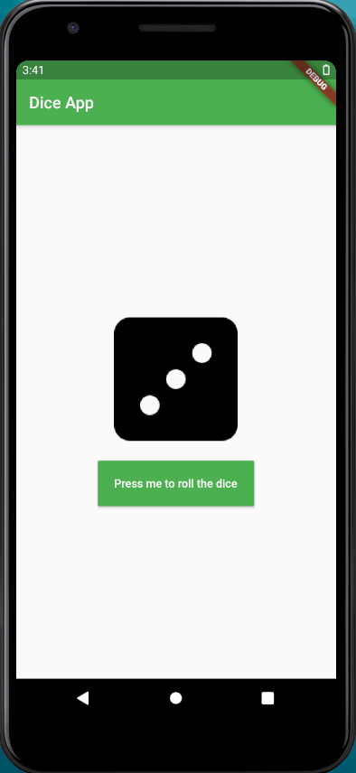
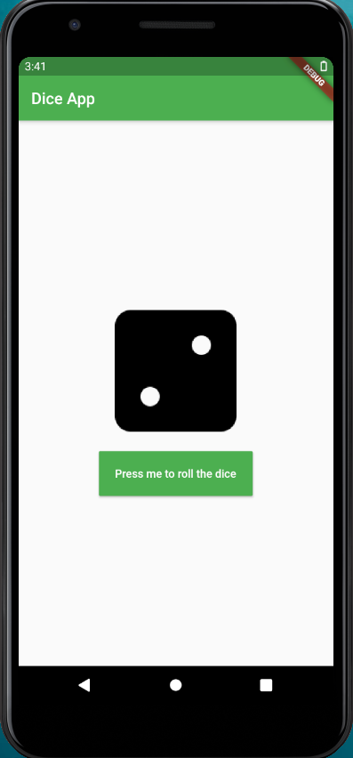

# Simple_dice_roller_app

<b>About the app </b>
A simple dice app made with flutter that rolls on click. For this,I have added a button and when we click on it the dice should roll.
### 👉 If you like this repo then please give it a ⭐️
<b>Some snaps from the app</b>

 

 ### Getting Started
This project is a starting point for a Flutter application.
 
A few resources to get you started if this is your first Flutter project:
<ul>
 <li>
  <a href="https://flutter.dev/docs/get-started/codelab">Lab: Write your first Flutter app</a>
 </li>
 <li>
  <a href="https://flutter.dev/docs/cookbook">Cookbook: Useful Flutter samples</a>
 </li>
 </ul>
For help getting started with Flutter, view our <a href="https://flutter.dev/docs">online documentation</a>, which offers tutorials, samples, guidance on mobile development, and a full API reference.

